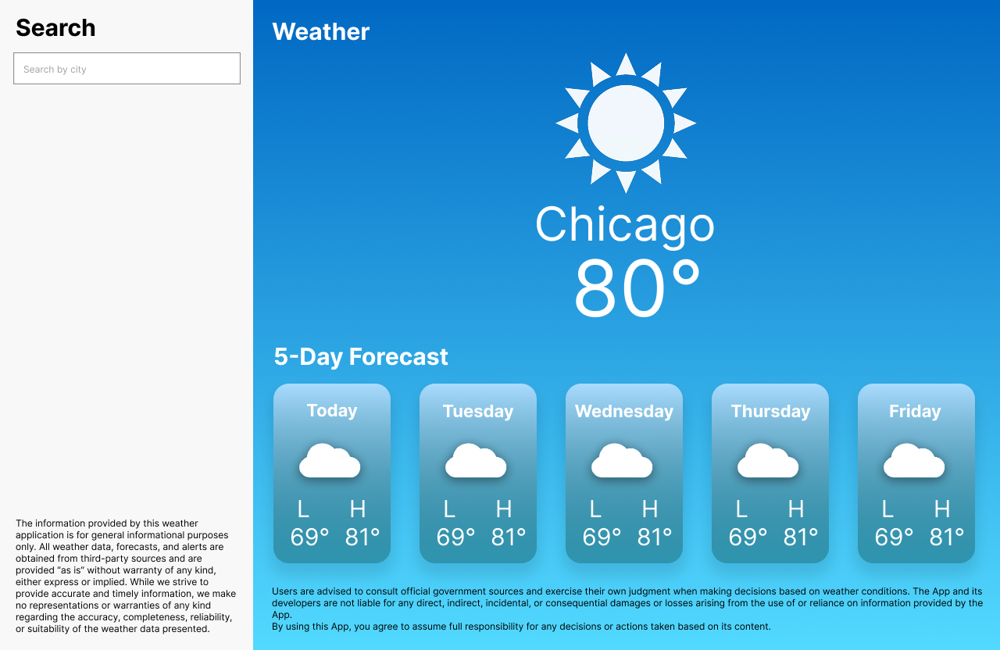

# Weather App

## Acceptance Criteria

* The user can search for any city and get the weather forecast.
* In the search result, the user can see the current weather status.
* The user can see the weather for the next 5 days.
* Using CSS, style the front-end application to match the provided reference file as closely as possible.

## Main stack
* React (vite-bundler)
* TypeScript

## Testing stack
* Jest

## How to run the project
1. Clone the project
```bash
 git clone https://github.com/pvcnogueira/test-coates-weather.git
```
2. Navigate to the project directory.
    ```bash
    cd test-coates-weather
    ```
3. Install dependencies:
   ```bash
   npm install
   ```
4. Start the development server:
   ```bash
   npm run dev
   ```
   
the app will run on `http://localhost:3000`


# How to run the tests
1. Navigate to the project directory.
   ```bash
   cd weather-app
   ```
2. Run the tests:
   ```bash
   npm run test
   ```
## mockup

